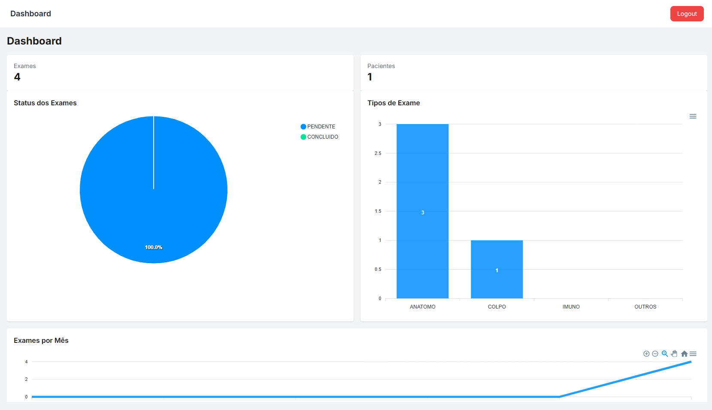
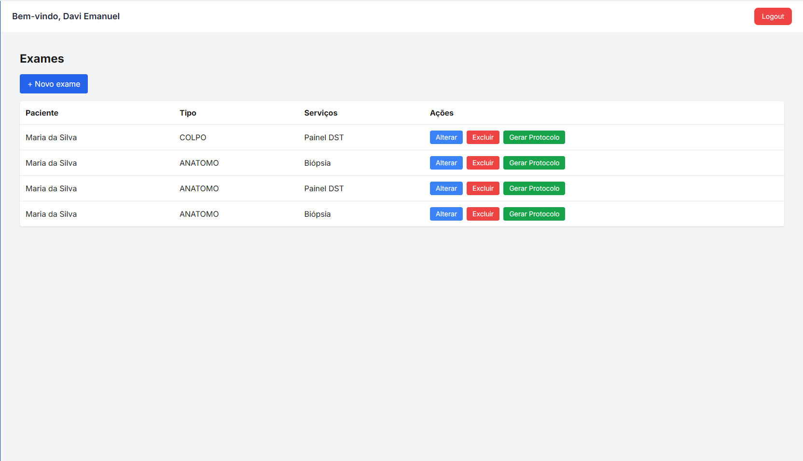
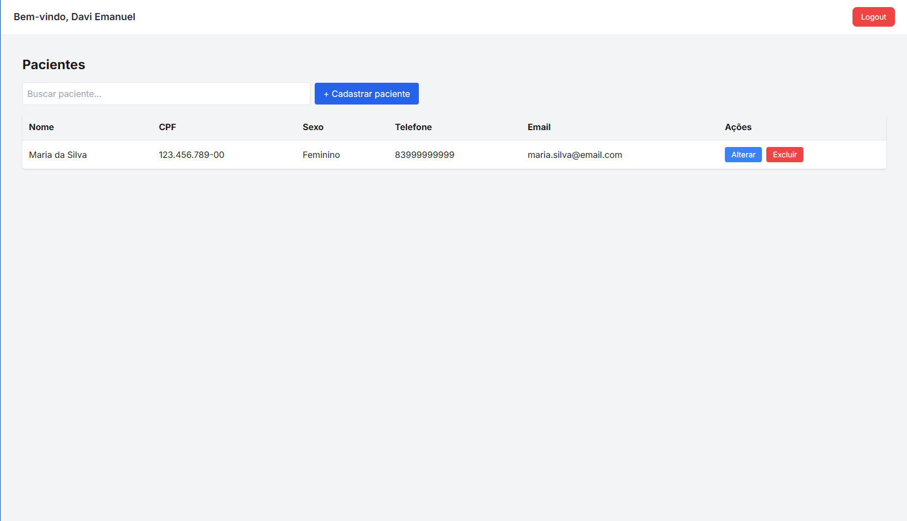
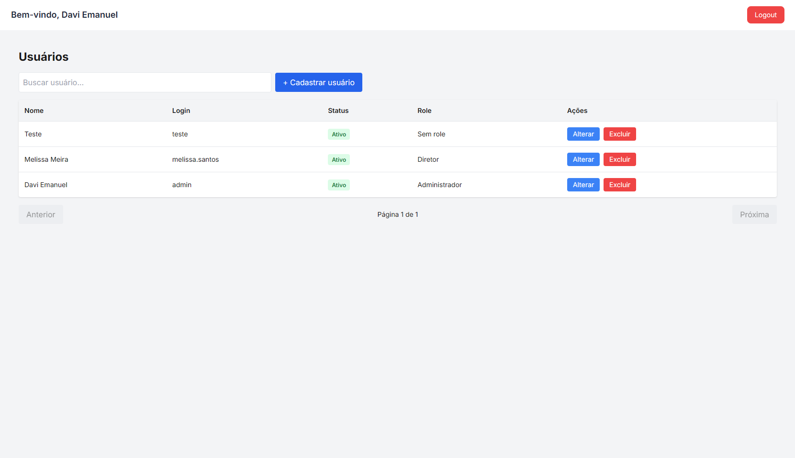
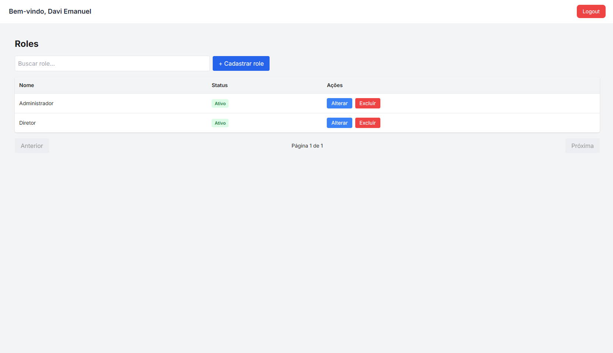
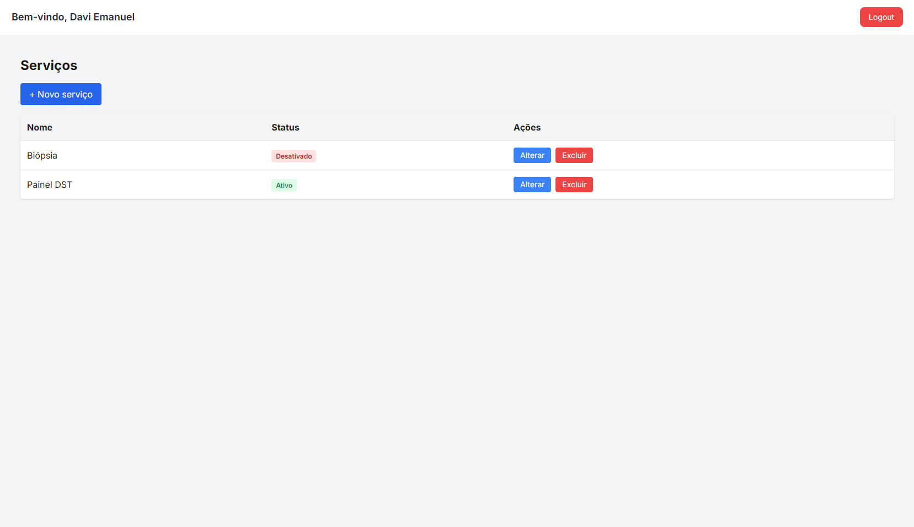
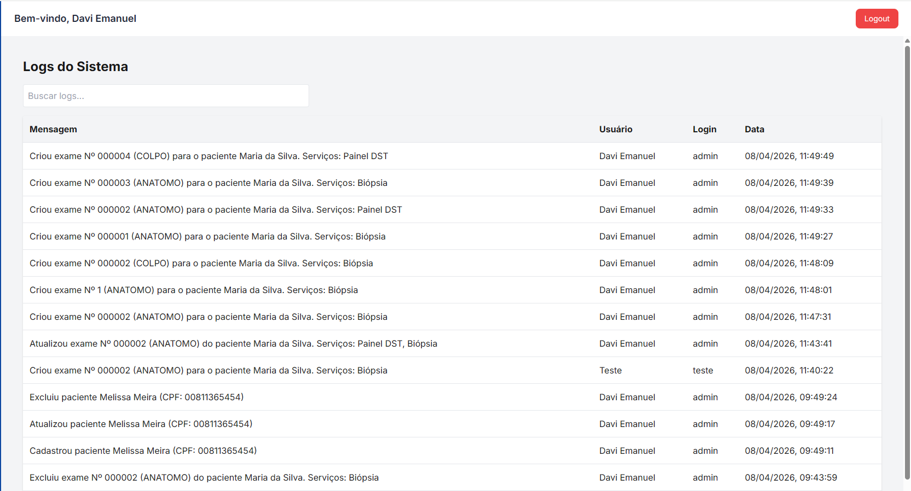

# 🏥 Exam Management System

Sistema completo de gerenciamento de exames laboratoriais desenvolvido com foco em organização, controle de fluxo clínico e rastreabilidade de informações.

---

## 📌 Visão Geral

O **Exam Management System** é uma aplicação full stack para gerenciamento de exames laboratoriais, permitindo o controle de pacientes, usuários, serviços, exames e auditoria de ações do sistema.

O sistema simula um ambiente real de clínica/laboratório, com autenticação, controle de permissões e geração de documentos (PDF de protocolo).

---

## 🚀 Funcionalidades

### 👤 Usuários e Autenticação

- Login com autenticação segura
- Controle de acesso por roles (RBAC)
- Proteção de rotas no frontend e backend

### 🔐 Permissões (Roles)

- Criação e gerenciamento de roles
- Permissões associadas a funções do sistema
- Controle de acesso por nível de usuário

### 🧑 Pacientes

- Cadastro completo de pacientes
- Edição e remoção
- Associação com exames

### 🧪 Exames

- Criação de exames por paciente
- Associação de múltiplos serviços
- Tipos de exame (Anátomo, Colpo, Imuno, Outros)
- Atualização e exclusão

### 🧾 Serviços

- Cadastro de serviços laboratoriais
- Associação com exames

### 📜 Logs (Auditoria)

- Registro de ações do sistema
- Histórico de alterações
- Rastreamento de atividades de usuários

### 📄 Geração de PDF

- Geração de protocolo de exames
- Documento estruturado com dados do paciente e serviços
- Utilização da biblioteca **pdfMake**

---

## 🧱 Tecnologias Utilizadas

## 🚀 Frontend

- Next.js
- React
- TypeScript
- React Hook Form
- React Select
- TanStack Table
- pdfMake

---

## 🌐 Acesso ao sistema

Frontend rodando em:  
https://exam-management-system-frontend-phi.vercel.app/login

---

## 🔐 Acesso ao sistema (importante)

O sistema permite o **cadastro de usuários**, porém o usuário criado por padrão possui acesso limitado, com apenas **1 rota liberada**.

Para visualizar todas as funcionalidades e permissões do sistema, utilize o usuário administrador:

- 👤 Usuário: `admin`
- 🔑 Senha: `123456`

---

### Backend

- Node.js
- Express
- Prisma ORM
- PostgreSQL
- JWT Authentication

## API

Backend rodando em:

https://exam-management-system-backend-6gzw.onrender.com

## API Documentation

Swagger:
https://exam-management-system-backend-6gzw.onrender.com/docs

---

## 🏗️ Arquitetura

O sistema segue uma arquitetura modular baseada em responsabilidades:

- Controllers
- Services
- Repositories (via Prisma)
- Middlewares de autenticação e autorização
- Separação clara entre regras de negócio e camada de API

---

## 📄 Exemplo de Funcionalidade (PDF)

O sistema gera automaticamente um protocolo de exame contendo:

- Dados do paciente
- Tipo de exame
- Serviços vinculados
- Data de emissão
- Número de protocolo

---

## 📸 Demonstrações

### Dashboard



### Exames



### Pacientes



### Users



### Roles



### Services



### Logs



### Sidebar


---

## ⚙️ Como executar o projeto

### Backend

```bash
cd backend

npm install

npx prisma generate

npx prisma migrate dev

npm run dev
```

### Frontend

```bash
cd frontend

# instalar dependências
npm install

# iniciar projeto
npm run dev
```
